

  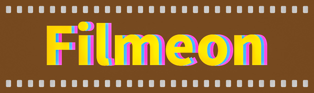

Physically grounded color-managed HDR-capable color negative film inversion model in DaVinci Resolve

- [What is this](#what-is-this)
- [The theory behind it](#the-theory-behind-it)
  - [Tone curve](#tone-curve)
  - [Converting to scene-linear exposure values and tone-mapping](#converting-to-scene-linear-exposure-values-and-tone-mapping)
  - [The Color](#the-color)
- [How to use this in practice](#how-to-use-this-in-practice)
  - [Installation](#installation)
  - [Usage](#usage)
    - [Preparing the scan](#preparing-the-scan)
    - [The process](#the-process)
    - [Demonstrating the Compromise 2 workflow](#demonstrating-the-compromise-2-workflow)
  - [Notes on ICC profiles and HDR output](#notes-on-icc-profiles-and-hdr-output)

## What is this

This is a scene-referred color-managed approach to inverting color negative film scans adapted for use in DaVinci Resolve. By grounding the math in the physics of the way that both film and scanners work, we are attempting to achieve a consistent way of getting good results (accurate tone response and pleasing colors) from the film negatives.

The process is somewhat inspired by the pipelines used in Hollywood for scanning motion picture film, like the old Kodak Cineon System and the modern ACES workflow (ADX/APD), but with more flexibility to fit the needs of uncalibrated home/consumer scanning. We don't have to use color targets or exposure ramp film strips (though, of course, we can if we need to).

First, a little bit about the theory behind it.

## The theory behind it

The problem with a more "naive" approach, which you might have seen elsewhere (when a negative scan is inverted and then curve-fitted directly into an SDR output), is that it mixes together the properties of the film, the scanne,r and the scene together in a way that makes the look of the final image somewhat arbitrary and the process is inconsistent.

What we want instead is to turn the negative into a more or less linear representation of the photographed scene, and then tone-map it into the desired output, whether it's SDR or HDR. That way, we can do the color interpretation, white balance, and exposure adjustments independently, as well as correcting for the deficiencies of the scanner in a consistent, repeatable way.

### Tone curve

Let's use a simulated scan of a greyscale gradient shot on Kodak Portra 400. This is what a simple inversion would look like, if you somehow knew exactly how to adjust the curves directly:

Instead, the best way to understand the tone response of color negative film is to look at the characteristic curves (also known as Hurter–Driffield curves or H-D curves). These curves live in logarithmic mathematical space, plotting the logarithm of the exposure against the optical density (or, otherwise, the logarithm of opacity) of the developed film.

If we convert our simulated scan into density space, we can see them more clearly (100 on the Y axis corresponds to a density of 3.0):

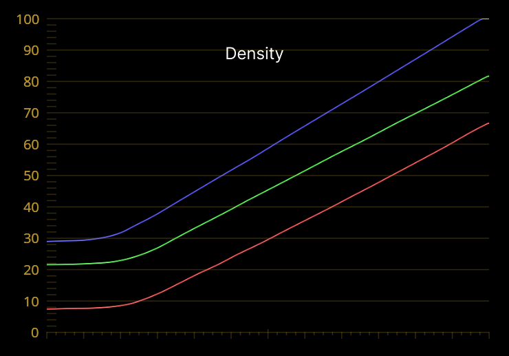

We can see that the majority of the film's dynamic range now lies on three straight lines. They are offset from each other and have slightly different slopes (gammas). Additionally, they have a compressed region at the bottom (the toe) and the top (the shoulder).

_The shoulder is not actually shown here (nor on the chart that Kodak published for Portra 400, from which our simulated scan is derived), but it's there, in the exposure range beyond to the right. I did, however, choose the chart that omits it intentionally, to simplify the visualization and because we don't really model the film's shoulder (but more on that later)._

Here is where the first property of the scanner might come into play - the veiling glare (or flare). This is the stray light that can bounce around inside the scanner's optical system and illuminate the film from the same side as the sensor (where we don't want it) or, otherwise, the light that is scattered inside the film strip itself, especially if the light source is positioned very close to the film. This is not much of an issue in a good DSLR scanning setup, but it is more pronounced in, for example, consumer slide film scanners (like Plustek). We model this effect as an additive (offset) in the scan (transmittance) space, which translates to a non-linear shoulder-like compression in highlights in density space. Worse still, it's different per channel, resulting in a color cast in highlights. Let's simulate this effect in our scan:

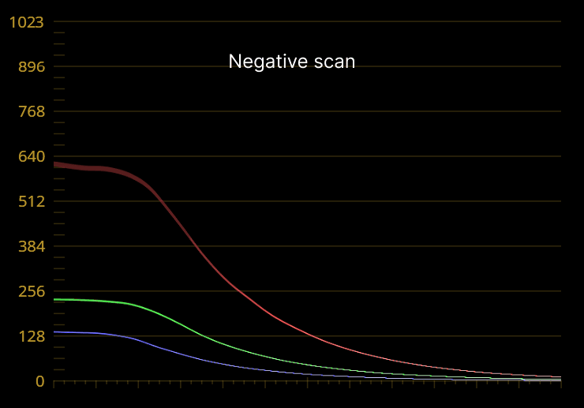

Now that we have a more realistic (worst-case scenario) scan, we can balance and linearize the density curves. In our workflow, we do this by color-picking the film base and two neutral points in the reference scene, then adjusting the glare compensation per channel, and linearizing the film's toe (if necessary, more on that later).

_The Cineon System, among other things, defined a specific scale for representing scanned density values in 10-bit files for storage and interchange (minimum density starts at 95/1023, with every next code value increase representing 0.002 units of density). We will use this scale for the purposes of our demo._

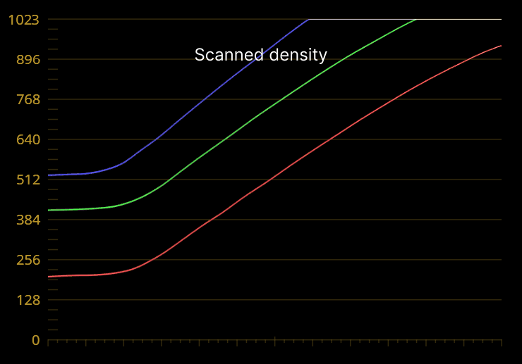

Now that all three curves are mostly straight and aligned, we essentially have our log-encoded scene exposure values scaled by some factor, which is the overall film gamma $\gamma$ (how tightly the scene's dynamic range is packed into the film's density range).

On the following chart, you can see this visualized: the thin green line representing the ideal $\gamma=1.0$ response, in relation to our film's actual (now aligned) curves. Depending on how the film was developed (time/temperature affects this) and scanned (more on this later), this gamma can vary a bit, but usually, in a good scan, it would sit somewhere around 0.6.

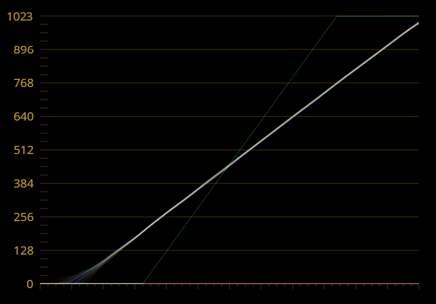

### Converting to scene-linear exposure values and tone-mapping

We now know that we need to match the film's gamma $\gamma$ to re-scale the curve, but we also need a reference/anchor point to match the shot's exposure level. Our approach offers two formulas for doing this with two slightly different philosophies.

The first one is a classic Cineon formula that anchors the image between a black and a white point. You choose the gamma (defaults to $\gamma=0.6$) and the white point (defaults to $D=1.18$), which maps to a linear exposure value of $E=1.0$, and the $D=0.0$ is mathematically forced to land on $E=0.0$ (using anti-log black offset). The rest of the exposure range (super-whites) land at $E>1.0$ accordingly. Because of this black offset, we do not need to (in fact, we should not) linearize the toe. This approach is less physically accurate, as it ignores the actual shape of the shadows.

This is also the formula used in DaVinci Resolve's built-in (CST) Cineon Log to Linear transform.

_Here, the $D$ values represent the density above the film base, as we've subtracted that already as our first step._

The second (better) approach is what is sometimes referred to as Josh Pines' formula, which uses a single middle (18%) grey anchor point. This value (defaults to $D=0.7$) is mapped to $E=0.18$, and the rest of the exposure values fall where they may according to the chosen gamma (again, defaults to $\gamma=0.6$); there are no white or black points. Toe linearization is necessary in this case if we want to represent scene shadows accurately (though, of course, you can skip it if you want to preserve the film's raised blacks creatively).

And finally, once we have our scene-referred exposure values, we can have our output transform/tone-mapping into display-referred space, e.g., applying the reference OOTF for better shadow rendering and highlight roll-off to fit $E>1.0$ values into the target range (SDR or specific peak HDR brightness). This is also one reason why we didn't model the shoulder of the actual negative - the tone-mapping ("print" shoulder) is going to either compress (or un-compress, depending on the settings) the highlights anyway, depending on the desired output.

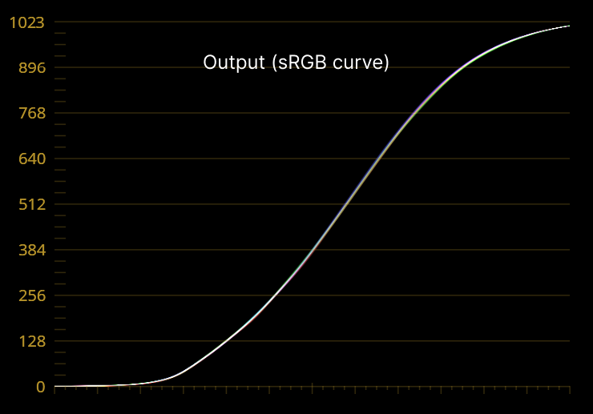 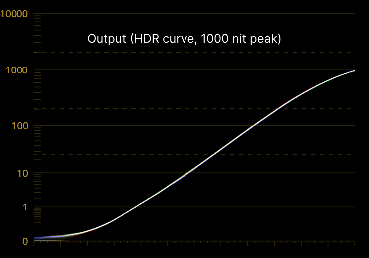

### The Color

This is perhaps the most important part. As already mentioned, the look you get from an inverted negative scan is often quite arbitrary if we don't account for the factors that influence it. If the stars align, it might even turn out to look pleasing, or it might not, but more often than not, what you get does not represent any kind of native film look. Well, what is a "film look" anyway? Why do some people say "X film has a better skin tones, while Y film has better greens, but renders the skin that's too pink".

The truth is that each specific color negative film was designed to only be half of the complete photographic system, the other half being the printing process using a specific, corresponding type of printing paper (or print film). Only together did they produce the desired color rendition, which one could call the true "film look".

So, the major factors at play here are:

- The spectral sensitivity characteristics of the unexposed film's three dye-forming layers
- The chemistry of the development process that forms the dyes (perfect reproduction was never the goal; for example, the DIR (Development Inhibitor Releasing) couplers selectively block the formation of one dye in the presence of another, thus chemically separating the color channels)
- The spectral absorption characteristics of the dyes formed during development (the dyes are not perfect absorbers)
- The spectral emission characteristics of the light that shines through the film

The print paper's own characteristics were engineered to account for and complement all of the above, to produce the specific result. And obviously, no major film manufacturer ever designed a process that would render the skin that's "too pink". Thus, if in your digital scan you're seeing significant color casts in shadows or the highlights or dramatically shifted hues in skin tones or foliage, it's more likely that you're looking at the properties of your scanning and inversion process, rather than the film itself.

Essentially, our goal in this process is to be able to define our own digital "printing" color response in a way that is consistent and repeatable (across different scans of the same film).

For this purpose, we add two user-controlled 3x3 color matrices into our workflow. One applied in density space, to control the dye mixing/unmixing (a.k.a. crosstalk), and another one applied in scene-linear exposure space, to map the colors into a known display-referred color space.

_Technically, we'd need a third matrix to account for scanner sensor crosstalk (applied in linear transmittance space), but in practice, it's a bit of an overkill for a manual workflow like ours._

The density crosstalk matrix starts out as an identity matrix (original mix), and the direction of adjustment depends on your scanner setup. If you're working with a lab-like trichromatic scan (combined exposed under narrowband red, green, and blue light), where emission peaks of the lights are tuned to match the dye absorption peaks, you will measure density that is close to the actual dye amounts in the emulsion (analytical density). Then, you would want to mix the channels a bit to better map to the original scene capture, because we're working against the direction of the development chemistry (DIR couplers). If your scan uses a broadband (white) light source and wide capture bands, the density measurements will already be mixed up quite a bit and not in the way we want them. In this case, you would want to un-mix (separate) them instead.

_In addition to getting mixed density values, a spectrally leaky scanner setup will result in too much light being recorded across all channels, lowering the overall measured density values, and thus, default gamma and exposure anchor assumptions used in professional lab scanning are likely not going to be good for us. That's why we're using adjustable parameters in our density-to-scene linear formulas._

Let's look at some sample scans of the same negative to demonstrate what we're talking about. The shot is Kodak Gold 200 under tungsten-like (very warm LED) light. We have a Plustek 8200i scan (white LED) and 3 DSLR scans with white LED, RGB LED (white iPad screen), and a 3-color scan (using iPad P3 1000 nit color patches and a single sensor channel per exposure, not exactly lab grade but good enough for this demo).

Note, we're looking at the density values, not actual colors. We're just looking at them as if they are sRGB colors for visualization purposes. Also, the shots had their scale (gamma) adjusted to match so we'd only focus on the color separation differences:

After density mixing adjustment, we can see the differences going away (as much as possible):

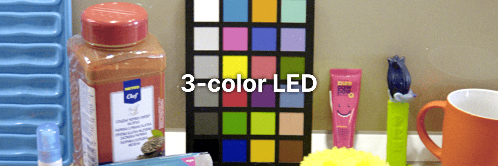

The second (linear exposure) matrix starts out as a reference transform inspired by the one used in ACES. It should provide a good enough starting point, but you can tweak the color vectors to actually lock in the look you want. The control scheme for this one is primary color vector rotation and scaling in CIE chromaticity space; if you've used the Color Calibration (or Camera Calibration) tool in Lightroom before, you'll already be familiar with how this works.

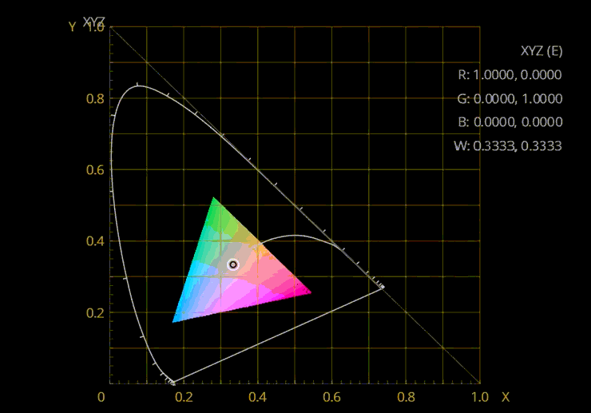

And so, our two matrices together result in a consistent and repeatable custom color response for a given film stock shot under a given illuminant, while (mostly) accounting for the properties (or deficiencies) of your specific scanner setup. Think of this as a custom digital printing paper.

Here are our sample scans, with dyes remixed (individually for each scan) and after final transformation into display color space (same for all scans):

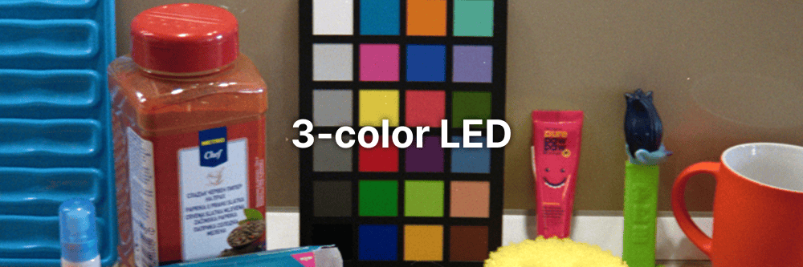

Just for reference, here is an unadjusted digital shot (under Adobe color management) of the same scene. We're not trying to match the film scans to it, but nevertheless, it makes for an interesting comparison:

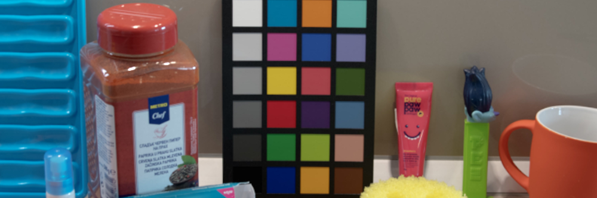

Finally, for any shot with different lighting conditions from our reference, if the illuminant difference is not too extreme (e.g. different varieties of daylight) we can get away with just tuning the white balance slightly. However, if the lighting is very different (e.g. very warm tungsten-lit indoor scene vs cool daylight outdoor reference), we might need to either tweak the second color matrix (because the predictability of linear color transforms is limited by illumination constancy, including in digital photography), or we can try using a chromatic adaptation transform (CAT) which should result in more accurate colors than just white balancing. Thankfully, DaVinci Resolve already comes with a CAT node built in, so we don't need to reinvent the wheel here.

_It might feel like we're mixing color grading into our scanning process, but as we've already discussed before, the film's development chemistry and the optical printing process for which the film was designed were themselves a kind of organic color grading, built in by the manufacturer. It's just that it was done by e.g. Kodak or Fuji engineers, rather than the photographer. I think the main point here is that the parameters we're trying to tune in our process are global, roll and scene-independent, representing some physical truth about the scanner, the film stock and our desired output._

But let's actually see how to use this in practice.

## How to use this in practice

### Installation

1. Clone or download and unzip this repository
2. Copy the `Filmeon` folder with the DCTLs into your Resolve's `LUT` folder
   - on Windows, this is usually `C:\ProgramData\Blackmagic Design\DaVinci Resolve\Support\LUT`
   - on MacOS - `~/Library/Application Support/Blackmagic Design/DaVinci Resolve/LUT`
3. In Resolve, right-click inside the Gallery/PowerGrade, choose `Import`, and select either of the two files from the `powergrade` folder

### Usage

#### Preparing the scan

The process requires a **linear and non-colormanaged** scan as an input.

If you're using a dedicated film scanner through SilverFast or VueScan and you scan in RAW and your output is a TIFF file, then you should be good. If it's a DNG, make sure you know how it's tagged, because Resolve will try to interpret it according to the settings in the Camera RAW module. For example, my Plustek DNG scans from SilverFast require setting the white balance in Camera RAW to "Cloudy" (6500/10) and the color space to Rec.709 / Linear to make sure the RAW processor outputs the original sensor data as-is (no-op). Alternatively, you can just convert the DNG back to a TIFF, as described below.

If your scans are DSLR/Mirrorless shots, you'll need to convert the DNG or camera-native RAW files to linear non-colormanaged TIFFs. One way to do this is using the [MakeTiff](https://www.colorperfect.com/MakeTiff/) utility. It will debayer the RAW data, but otherwise will output the original sensor data as-is. This is very different from just exporting a TIFF from Lightroom; even a linear 32-bit float TIFF will already have Adobe color management baked into it, which is not what we want.

The resulting files from MakeTiff will look greenish, and that's as it should be, because you're seeing the raw channel values before the white-balance scaling. You might think this is because the Bayer filter has more green pixels, but actually, the reason for this is that most camera sensors' green cells are simply more sensitive to light. This is also the reason why you should be very careful if you're using ETTR when scanning the film - the green channel will clip first, and the histogram on your camera will likely lie about where the clipping happens. Clipped green channel in the thinnest/low-density parts of the negative is a great way to ruin the shadow neutrality in a scan. If you want to learn more about this, I'd recommend checking out some articles about **UniWB**.

And obviously, for the inversion process to be able to produce consistent results and the settings to be meaningfully reusable, you should be locking down your scanning setup as much as possible. The camera, lens, and exposure settings should be locked at least for the entire roll. Light source (both spectrum and intensity) should be locked at least across all the rolls of the same film stock.

#### The process

Our first step is picking the film base and two neutral colors from the reference shot. Unfortunately, the color pickers on the Color page in Resolve can only pick from a single pixel, and the values are quantized to 8 bits (no matter what the tooltip says). This is not good enough for our purposes, so we need to make some compromises:

Compromise 1: Do the entire work in the Fusion page. Fusion color pickers pick raw 32-bit float values, can pick values <1 or >0, and can pick an average from an area. The downside is that it's just not that convenient to work in Fusion.

Compromise 2: Pick the colors in Fusion, then transfer them to the Color page. We'll have to use some trickery for this. In the FilmeonScan DCTL, this is what **Write Ref**/**Read Ref** checkboxes are for. When **Write Ref** is checked, the node skips any other calculations and just writes the picked colors into the image itself as the first 3 pixels. Then on the Color page, **Read Ref** reads those pixels instead of using the color pickers. For this to work, either the timeline resolution must exactly match the scan, and you cannot do rotating or cropping, or you need to create a New Fusion Clip from a resized/rotated/cropped version and work on that. Then you can just copy-paste the Fusion grade across all the clips (shots of the same roll), and they will all read the same reference colors. The downside here is just all the complexity, though this is the most precise way to do it.

Compromise 3: This is the easiest way and one we'll focus on. The powergrade includes additional nodes for this purpose. We use the Blur node to compensate for the lack of area-averaging, and we pick the film base using the **Pick White Point** of the **Gain** primary color wheel in the previous node instead. The Scan node then receives the channels already pre-scaled. That way, we can minimize the impact of the 8-bit quantization when picking the two neutral points (because the ranges are now bigger). If we want/need to do Glare correction, we'll need to manually copy the Gain coefficients to the Scan node, so that it can work out the original scanneed values internally (because Glare correction only makes sense relative to the actual unaltered scanner output).

So, assuming we go with Compromise 3, let's run through the nodes in the Filmeon powergrade:

- **Zoom** (Transform)
  - Can be used for temporarily zooming in to crop out the film/holder frames so that we can see the **extents** on the parade/waveform scope to help with adjusting the film base offset and highlight clipping. It can also be used for actual framing/cropping, but personally, I prefer to do this outside Resolve, in a software better suited for working with images.
- **Blur** (Gaussian Blur)
  - As mentioned, used as a workaround for not having area-averaging color pickers
- **Base** (Primary Gain Wheel)
  - Used to pick the film base ($D_{min}$ / $T_{max}$)
  - Lum Mix must be set to 0 to work with channels independently
- **Scan** (FilmeonScan DCTL)
  - This is the node that's responsible for converting the linear scan into adjusted density-like values
  - The first six sliders control the density mixing (our first color matrix). Positive values mix the channels, negative - unmix them.
  - **Dmin Offset** allows shifting all three channels up and down for better alignment of the film base to 0
  - **Gamma Boost** allows for pre-scaling all three channels if we want to calibrate the measured gamma of the scan (can be beneficial to improve the toe linearization accuracy). Otherwise, you can always match the gamma later, when converting to scene-linear exposure.
  - Next three sliders control **Glare** subtraction per channel. **Glare G** has **(RGB)** in the label, because our balancing logic anchors everything to the green channel, so glare subtraction on it would visually affect all three channels in the output.
  - Four sliders for toe adjustment. Stiffness is something like the strength of the curve bend, and the other sliders control the strength of the unbending per channel. We model the linearization as a subtraction in the opacity space, so it should be more physically accurate than simple curve fitting.
  - **Temp/Tint** controls adjust the reference photo white balance (offsets in density space). The overall balancing (gamma + offsets) relies on picking two neutral colors in the scene, but in practice, you just need something that's _nearly_ neutral for gamma-alignment to work, and then it's just the offsets that will be slightly wrong. In this case, they can be corrected here.
  - Three **T scale** inputs are needed to tell the math the original scale of the scan, so that the **Glare** adjustment slider values work on original data, before the film base scaling node, because we're fixing the scanner, not the film. That way, they can be reused across different rolls, which will likely have slightly different film base levels. Just copy-paste the gain coefficients from the previous node here. Of course, if your scanning setup doesn't require glare correction, you can skip all this.
  - Three **Adjust X** checkboxes simply allow to toggle the adjustments on and off. For example, as mentioned before, if you're going to use the classic Cineon formula for linearizing the density, you'd want to keep the **Adjust Toe** disabled.
  - **Write Ref**/**Read Ref** are used for transferring the picked reference colors from Fusion to the Color page, as described above
  - **Cineon Scale** toggles whether we're outputting density values in Cineon Log or in the raw density units (default)
  - **Inverse Mode** essentially reverses the math, allowing for the simulation of a scan from idealized density values. All other controls work in reverse in this mode.
  - **Balance Mode** switches between whether we're using two neutral points to align the channels or a single point (if both selected, the brightest). If only one point is selected, single-point balancing is used in both cases.
  - And finally, our three color pickers
- **Lin** (FilmeonConvert DCTL)
  - This node is primarily used for converting to and from density values
  - The modes we're interested in are **D to E** (classic Cineon) and **D to E (Pines)** (Josh Pines' formula), which convert the density to scene-linear exposure
  - In these modes, you can adjust the assumed film gamma (output contrast) and exposure anchor point (either white or middle gray, depending on the formula)
  - Additionally, here you can also adjust the per-shot white balance
  - **Adjust X** checkboxes toggle the exposure and white balance sliders on and off
  - **DI TF** - encodes the converted linear exposure values using **DaVinci Intermediate** transfer function so that the data is easier to work with (e.g., if we want to apply noise reduction or just do some further grading)
  - **Film Ref (DWG)** applies the reference Film-to-Display color transform (this is the starting point for our second color matrix) into **DaVinci Wide Gamut** color space
  - **Cineon Scale** toggles whether the input density values are the raw density units or Cineon Log (by default, we're skipping this just to avoid unnecessary conversions)
  - Other modes include the reverse conversion (from scene linear to density, all other controls also become inverted) and the basic density-to-transmittance and transmittance-to-density conversion (all other controls do not function in these modes).
- **Gamut** (FilmeonGamutEditor DCTL)
  - This node allows adjusting the second color matrix by tweaking the hue (angle) and saturation (length) of the color primary vectors in CIE chromaticity space
  - **DI TF** decodes the input from DaVinci Intermediate to linear and encodes it back on the output
  - **Input Color Space** chooses the color space of the input (container space). In our case, set to **DaVinci Wide Gamut**
  - **Adjust Primaries** chooses the color space whose primaries (points of the triangle) we're adjusting. In our case, set to our reference Film space
- **CA** (Chromatic Adaptation)
  - An optional, alternative way to correct for different lighting conditions from the reference could be superior to simple white balancing in case of significant illuminant differences
  - You set the **target illuminant** (temperature/tint) to the lighting of the **reference shot** (the one we used for adjusting the color). Obviously, this is nothing more than an educated guess (unless it's known), but you can get pretty close if you know what lit the scene. Midday vs sunset, sunny vs cloudy, etc., gives you the temp. Daylight sun should be pretty tint-neutral, while LED lights usually register as having a noticeable green tint. _Importantly, this has nothing to do with the native balance of the film stock (daylight/tungsten)._
  - Then you can play around with the **source illuminant** sliders to correct for the actual lighting of the **current shot**. If the numbers stop making sense, you can go back to re-estimating the target.
- **ODT** (Color Space Transform)
  - This should be pretty straightforward for a Resolve user, but let's do a quick recap anyway.
  - We're converting from DaVinci WG/I to our target output color space.
  - SDR images are encoded using **sRGB/sRGB**. Alternatively, you can go for a wide-gamut **P3-D65/sRGB** combo (also known as Apple's **Display P3** or Adobe's **image P3**). Resolve is not actually capable of tagging (assigning ICC profile) image outputs, so sRGB/sRGB is the simplest option since most other software assumes it by default for images without a profile. Later, we'll go over how to assign the profile in Photoshop (also required for HDR output).
  - Tone-mapping allows for configuring the highlight roll-off by adjusting the **Custom Max. Input** slider until the desired scene white point becomes the SDR white.
  - **Apply Forward OOTF** - applies the reference transform from scene-referred to display-referred spaces. Practically, for our purposes, this works like a print/output tool, which improves the rendering of the shadows. Historically, it comes from the old SDR video standard (and subsequently codified explicitly in the current HDR standard). You can, of course, just use your own custom tone curve instead.

Well, I think that's about it. Let's see it all in action:

https://github.com/user-attachments/assets/fb84ed8d-ef1c-40c0-bffb-dff553047413

Some notes on what's happening in the video:

- All shots are from the same roll
- While it's great to be able to tune all the parameters off the same reference shot, it isn't necessary. Here we use different shots for different purposes: one to pick the film base, one to pick the two neutral points, and we look at multiple shots while adjusting the color.
- We use the **extents** view on the scope to be able to see the actual ends of the scan's dynamic range
- We use Cineon Scale mode and its corresponding 10-bit reference levels on the scope to calibrate the gamma (scale) of the density range in our scan. This is optional - usually, you can skip this and just adjust the assumed gamma in the conversion to scene-linear step, but it might be useful to have this done on the Scan node since it's going to be a global setting for the roll. If you actually have a shot with grey/white cards or a digital reference, this would be more accurate. Importantly, this is meant to only set the scale (i.e, the distance between grey and white), not their absolute positions (shot exposure). For creative/print-like rather than scientific output, this is definitely overkill.
- We convert **Base**, **Scan**, and **Gamut** nodes (optionally, **Zoom**/**Bloor** as well) into **Shared nodes** before copying the reference shot settings to the other shots. That way, we can keep adjusting the global settings while switching between shots separately from per-shot (exposure, WB, tone-mapping) settings.

Here are the resulting photos from the process in the video, both SDR and HDR versions (obviously, the difference is only visible on an HDR display).

 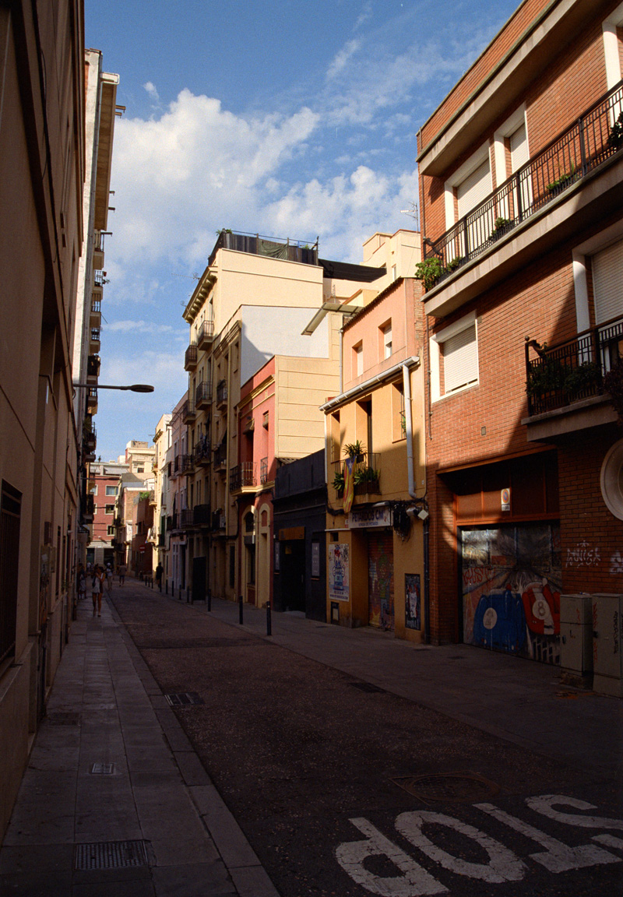
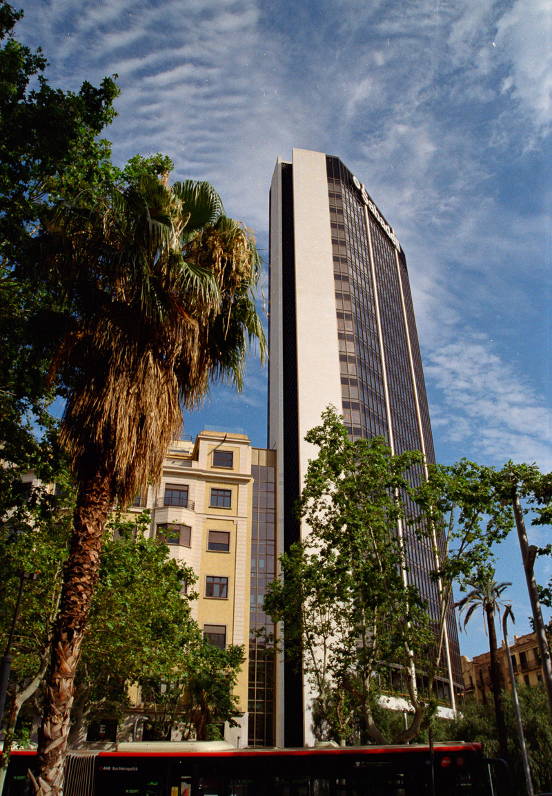 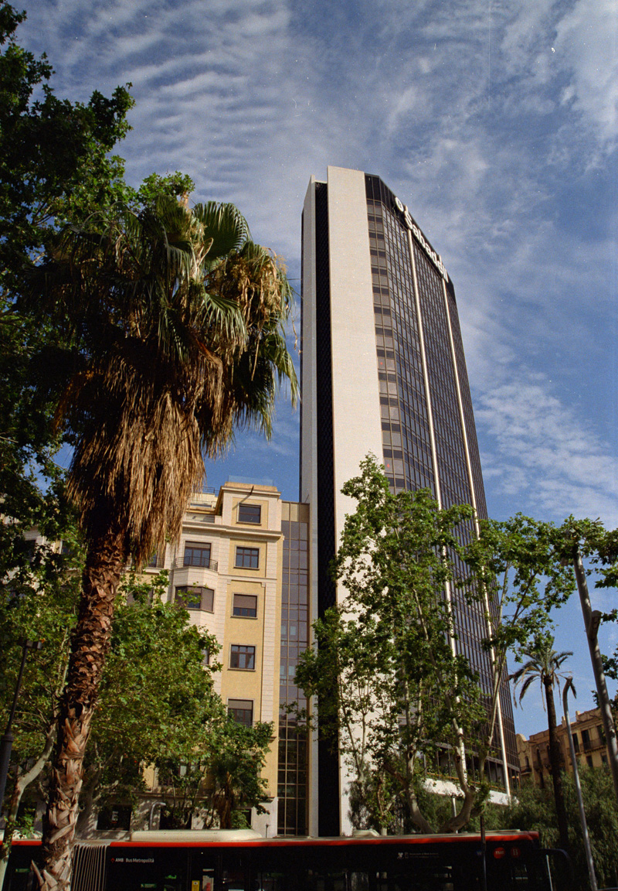
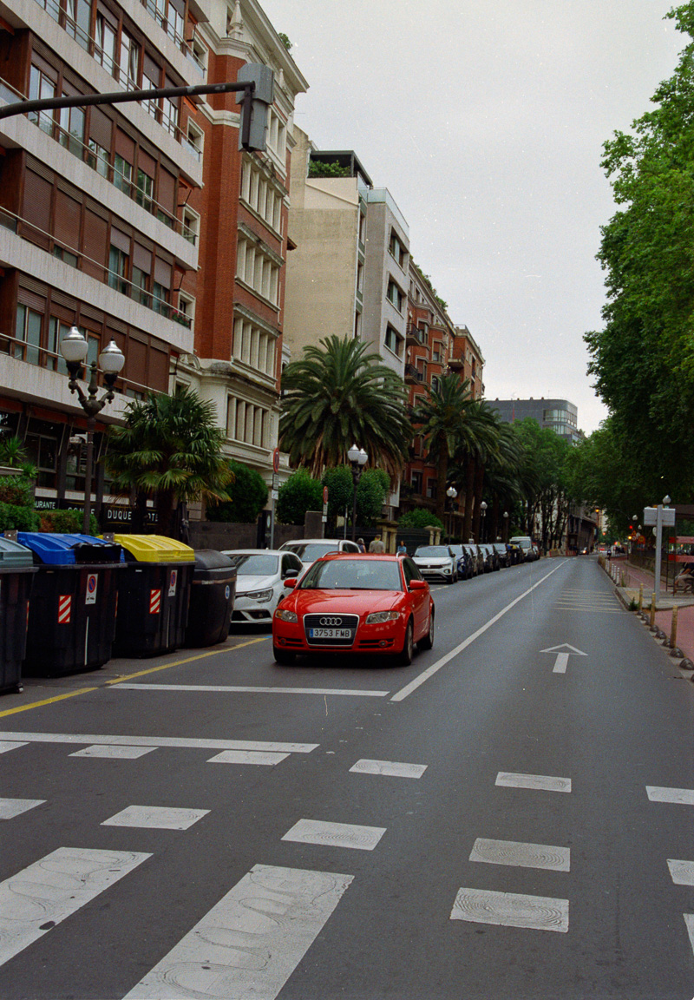 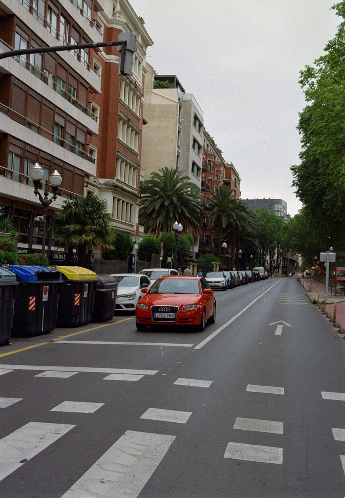
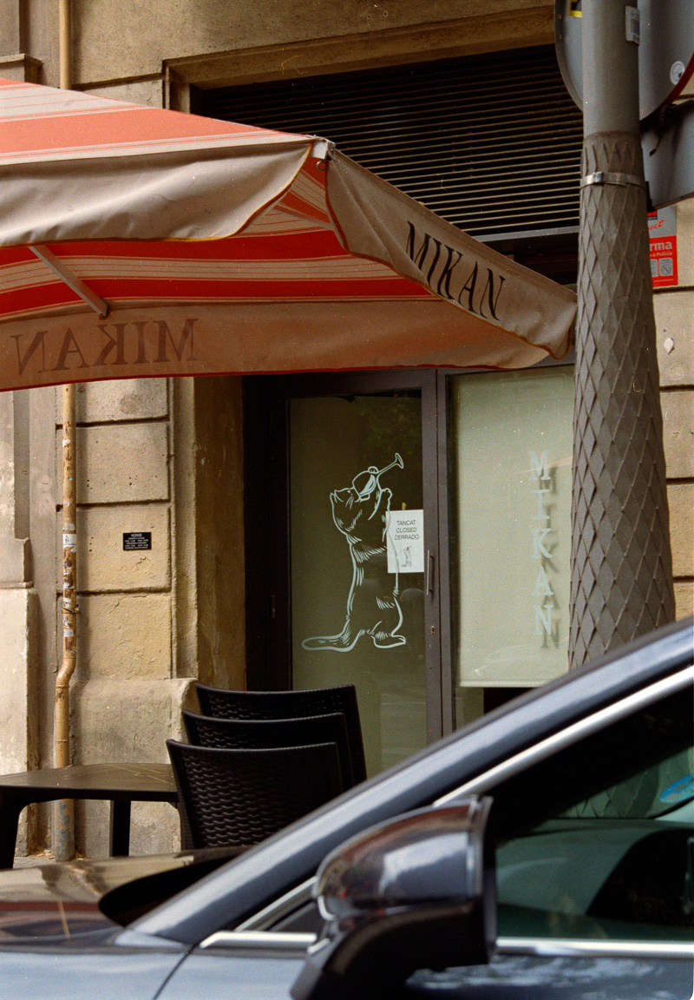 

_Tip: For dealing with different orientations, I personally prefer setting the timeline resolution to a square, with a side = max(width, height) of your scans and dealing with actual cropping post-deliver, in a software better designed for working with images_

#### Demonstrating the Compromise 2 workflow

Just to get this covered as well:

https://github.com/user-attachments/assets/a241a711-50df-4226-875c-aba6a0651ea9

### Notes on ICC profiles and HDR output

I'll describe the workflow I use. Perhaps there are easier ways to do this, but this is what works for me.

If you just need to properly tag a P3/sRGB JPEG, you open it in Photoshop, **Edit** > **Assign Profile** and choose **Display P3** or **image P3**, then save the image. Better still, record an Action with these steps, then use **Automate** > **Batch** to apply this to multiple images at once.

Now, for rendering the most compatible HDR output, I use Lightroom. JPEG (with gain map) is probably the best, since you have control over HDR > SDR tonemapping and the resulting image looks good (and the way you want it), both for people with or without an HDR display. Alternatively, AVIF is the best HDR-native format, with PQ encoding and actual MaxCLL/MaxFALL tagging, but the SDR fallback is out of your hands.

But in order to get the image from Resolve into Lightroom, we need to jump through a few hoops. You could tag a 16-bit TIFF with a PQ-based profile in Photoshop, but Lightroom, unfortunately, does not respect the absolute nature of the PQ curve, does its own interpretation into its own relative HDR paradigm (Lightroom works with "stops above SDR white", rather than display nits), and the image will look a little bit different as a result. The only way to get the image into Lightroom intact is to move the raw floating point buffer. Unfortunately, Resolve cannot output floating-point TIFFs, and Lightroom cannot read anything else.

So the hoops we need to jump through are:

- Set your ODT for transforming Davinci WG/I to P3 or Rec.2020 / PQ (ST2084) and check "User HDR 203 Nits Diffuse White" if it didn't get checked automatically.
- If you want the final JPEG(+gain map) output (relative HDR) to work with the full brightness capability of a target display, use **Custom Max. Output** of 1600 nits (you can use a smaller peak during grading if your display doesn't support it, just switch to 1600 for the final render). _1600 nit becomes 16.0 linear value that corresponds to 4 stops above SDR peak, which is Lightroom's internal **output limit**._
- After the ODT, add another CST node to convert the graded image back to linear data (e.g., P3/ST2084 to P3/Linear). Tone Mapping set to None, all checkboxes also disabled, we need a pure mathematical conversion.
- On Deliver page, choose **EXR** / **RGB float (PIZ)**. You can also use **RGB half (PIZ)**, if you're worried about disk space (these files are huge, even with PIZ compression). Render the images.
- At this point, we need to assign a corresponding linear ICC profile
  - If you don't have it, we can create it manually; **we only need to do this once**
  - Open Photoshop. **Edit** > **Color Settings**. Remember which profile is currently set in the **Working Spaces** / **RGB**. Click on **RGB** and select **Custom RGB**
  - Enter the name (e.g., Linear P3 or Linear Rec.2020), set the gamma to 1.0, white point to D65, and enter the chromaticity coordinates of the primaries of your chosen color space (you can look them up online)
  - Click OK. It will create the profile and make it the default RGB working space, which we don't need. Select the one we had there before. Hit **Cancel** to exit the Color Settings.
  - We can use the same approach to create a DaVinci Wide Gamut / Linear profile and actually render the images that way from Resolve, without clipping/mapping them to P3 in the first place. Just an option.
- Once you have the profile, open the EXR files and assign them to it, then save as 32-bit or 16-bit float TIFF files (ZIP compression helps reduce the file size, but it might take much longer to render; worth it if you plan to store them long-term, though). Again, to speed things up, record an Action and use Batch processing.

That's it. Now these files can be imported into Lightroom, and once you enable HDR mode, they should look exactly as they do in Resolve's viewer.

If you prefer, you can even skip the DaVinci grading entirely (even if it's just OOTF + tone-mapping settings), render the linearized scene data (coming out of FilmeonConvert node) into EXR as-is, profile it accordingly, and do the grading in Lightroom (regardless if you're targeting SDR or HDR). Floating point scene-referred TIFFs will then work sort of like RAW files in this case (in terms of how Lightroom's primary sliders will behave).
